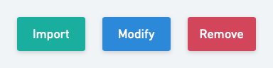
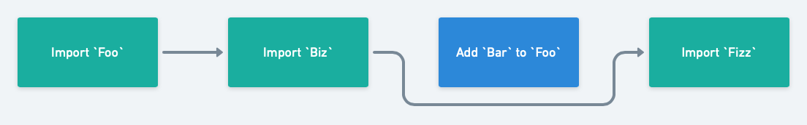
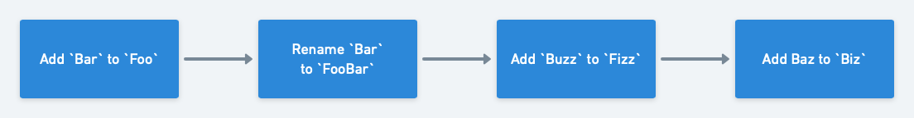
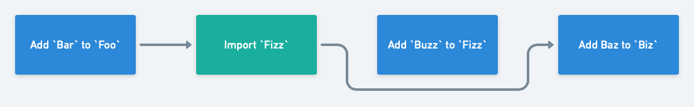

# OCL Migrations
The Config as Code feature brings the ability for users to store parts of their Octopus Server Data Model in both an external Git repository and the Database. 

To allow the internals of Octopus Server to still operate based on the model that it considers valid, we must migrate the VCS data to a state in line with the Octopus Server before using it in any capacity, similar to what we must do with the data model represented by the database.

In contrast to the database, we both want to avoid making unexpected commits to their repository on upgrades like database scripts, and would find such a task impossible, since old repositories can be loaded into Octopus “at run time” long after the server upgrade process has taken place. As a result any migration step must be assumed to potentially run against any future state of the database model. Even within a linked repository in a specific project, users are likely to switch between branches/commits that may be running different versions after migrations have already been run against other branches.

# Data Model Versions
The state of the data can be described by three versions:

## 1. `Server Version`
What's the current _latest_ supported version.
This will typically be defined by the highest numbered migration step available.

## 2. `Project Version`
What's the latest migration that's been executed against the project, regardless of branch.
This allows us to understand what migration steps have already been run for this project against other branches.
This is useful when moving data from the database into git, more details on this in the `Import` step.

## 3. `Branch Version`
What's the current schema version used in the _current branch_?
This is defined by a `schema_version.ocl` file stored alongside the rest of the octopus configuration.

# Execution
Before Octopus Server attempts to read from or write to any documents in git, it first ensures that the schema is up-to-date.
Octopus Server will compare the `Server Version` and the `Branch Version` to determine which migration steps need to be executed. The set of steps to be executed may be called a "session".
Under certain conditions, some steps will be skipped. For example: 
- If document `Foo` is imported, then there is no need to execute any other steps for document `Foo`, as it's already in it's most up-to-date shape. More info in the `Import` step.
- If document `Foo` is imported **and** removed, then **no steps** for document `Foo` will be executed, including the `Import` and `Remove` steps.

# Imported Document Snapshots
When a document is imported into git, it needs to be removed from the databse. If we simply remove the document from the database, then running the `Import` step on another branch will fail, as there won't be any document to import.
To solve this, we take a snapshot of the document at the time it was first imported. This snapshot is then stored in a discrete snapshots table in the database. `Import` steps can then use this snapshot in lieu of using the original table.

# Migration Step Types

## `Import`
- `Import` steps are responsible for:
    1. Loading documents from the database
    2. Performing any user-defined logic (E.g: making them "OCL-friendly", or updating references)
    3. Storing the document in OCL
    4. (If necessary) Snapshot the original document and delete it from it's table in the database
- If the version of an `Import` step is less than or equal to the `Project Version`, then the import step will source it's document from the stash. Otherwise, it sources it's document from the databse and takes a snapshot.
- `Import` steps are special, as they bring the document into git **in it's current, most up-to-date shape**, meaning any other migration steps for said document which would run after the `Import` step are made redundant.

## `Modify`
- `Modify` steps are fairly straightforward. Given a file name, they:
    1. Load the document as an `OclDocument`
    2. Allow for modification as necessary
    3. Write the end result back to git

## `Rename`
- As the name suggests, the `Rename` steps simply change the name of a document.
- `Rename` steps are separate from `Modify` steps as they allow us to correlate multiple migration steps even if the name of a file changes.
- When adding `Rename` steps, it's important to check over any prior migration steps that may have relied on the file that's being renamed. It's possible that previous steps may need to be refactored, or even completely re-written.

## `Remove`
- As the name suggests, the `Remove` steps simply removes the document from git.
- Similarly to the `Rename` step, it's important to check over any prior migration steps that may have relied on the file that's being removed. It's also possible that previous steps relating to the document will need to be updated to a no-op.
- If a document is to be imported and removed in the same migration session, then all steps relating to that document are skipped.
- Moving data from git to the database is not supported, and this step does not facilitate this behaviour.

# Migration Scenarios

## Legend

## Common

### Importing everything from scratch
When importing everything from scratch (E.g: when converting a project to version-controlled), all import steps are executed, and all other steps are ignored.

### A series of Modify steps
Another common scenario is a simple series of modify steps.

## Uncommon

### Importing a document after the schema has been initialized
If the schema is already initialized, and a new document has been since added to git, the import step will execute, but any further steps related to that document will be skipped.
In this case, `Add Bar to Channels` is skipped, because the `Import Channels` step will already import the channels in their most up-to-date shape.

### Removing a document from the schema
In the rare case that we need to remove a document from git, the remove step allows us to delete the document from git.

### Importing and removing the same document in the same migration session
It's also possible that a document will be imported and removed in the same session. In this case, all steps relating to that document are skipped.

# Testing
Because git schema migrations aren't as straightforward database migrations, it's important to ensure the OCL can be migrated **from any given version to the latest**.
As part of our test suite, we have an integration test set up to initialize a project at version `N`, then run migrations from version `N` to the latest, where `N` is any version number from `1` to `latest - 1`.
This ensures that the migration steps defined in Octopus Server bring the git repository into a known state, regardless of the starting version.

This diagram should help illustrate how the tests work. Each row can be considered a test case.

For this to work, a new snapshot must be created every time a new migration step is added.

# Best Practices

## One document per migration step
- **Don't** import and modify multiple different documents in a single migration step.
- **Avoid** using data from other imported documents where possible.
    - In some cases, this will be unavoidable, and that's okay.
    - If you **have** to use data from other documents, then make sure the migration step is easy to refactor in the event that the other document changes shape, or is removed.

## Limit databse access
- **Don't** write to the databse unless absolutely necessary (E.g: Updating references from an `Import` step)
    - This _could_ have side effects when executing the same step on a different branch, as the data has already been modified.
- If you **have** to use write to the database, then make sure the migration step is aware that the data might have already been modified.
- Convention tests are in place to help enforce this.

## Strongly typed documents
- These are okay in `Import` steps.
- Avoid using strongly typed documents in all other steps, as we can't gaurantee what shape the document is in at runtime.

# FAQ

## What's the point of the Project Version?
The `Project Version` is primarily needed when running the `Import` step.
When documents are imported into git, they're removed from the databse, and a snapshot is stored in the git entity stash.
So, if document `Foo` was imported when running migrations on the `master` branch, and we run the migrations again on `feature/my-cool-feature`, by checking if the `Project Version` is greather than or equal to the current version, we then know we should be fetching the document from the stash, and not the primary database table.

## What if I encounter a scenario that the existing migration step types don't cover?
The above migration step types aren't "final", we can still add new step types when the need arises.
