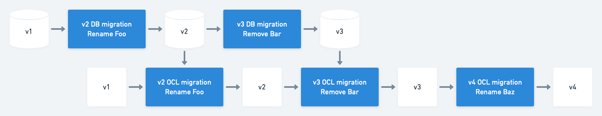
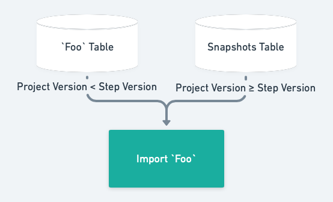
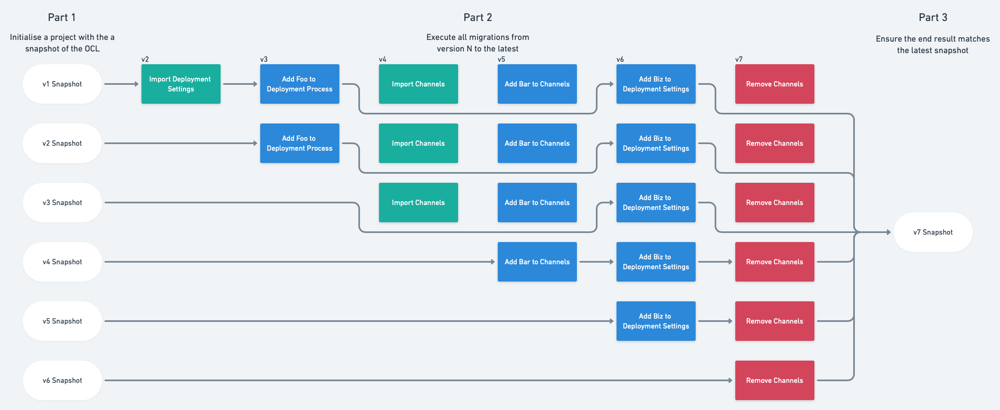

# Config as Code
The Config as Code feature brings the ability for users to store parts of their Octopus Server Data Model in both an external Git repository and the Database. 

To allow the internals of Octopus Server to still operate based on the model that it considers valid, we must migrate the VCS data to a state that is in line with the Octopus Server before using it. This is similar to what we must do with the data model represented by the database.

In contrast to the database, we want to avoid making unexpected commits to their repository on upgrades like database scripts, and would find such a task impossible, since old repositories can be loaded into Octopus “at run time” long after the server upgrade process has taken place. As a result any migration step would potentially need to be run against any future state of the database model. Even within a linked repository in a specific project, users are likely to switch between branches/commits that may be running different versions after migrations have already been run against other branches.

# Database Migrations vs. Git Migrations

## Database Migrations
- Self contained
- Occurs on startup to ensure a consistent and predictable state
- Full, one-time migration from A 👉 B

## Git Migrations
- Not self contained, some migration steps may require context of things outside the boundry of the data being migrated
- Migrations are executed as data is loaded, but only persisted on save
- The end result isn't (typically) a change to the database, but a state transition of the OCL data itself

### Server Schema Changes
The state transition for an OCL file is potentially dependent on the state of the database. The complexity arises when we realise that the state of the database changes _independently_ of the state of the OCL files.

### Repeatable Migrations
If the transition of an OCL file is potentially a two way interaction with a database, then how should we handle the migration having to take place multiple times, across different branches?

# Key Principles of Git Migrations
- Minimise the dependency between transformations with OCL and database cross context
  - Avoid destructive changes from the database that are not repeatable
  - Data should **NEVER** flow back from git to the database
- Data is stashed when removed from the database
- Strong type safety where necessary
- Unlike other migration steps, these steps **are** mutable
- _Testing_, **testing**, _**testing**_

# Implementation

## Versions
The state of the data can be described by three versions:

### 1. `Server Version`
What's the current _latest_ supported version.
This will typically be defined by the highest numbered migration step available.

### 2. `Project Version`
What's the latest migration that's been executed against the project, regardless of branch.
- Allows us to understand what migration steps have already been run for this project against other branches
- Useful when moving data from the database into git, more details on this in the `Import` step

### 3. `Branch Version`
The current schema version used in the _current branch_.
This is defined by a `schema_version.ocl` file stored alongside the rest of the octopus configuration.

## Execution
Database migrations are executed when the program starts.
This approach won't work in the world of git migrations for a number of reasons:
- Projects can have many branches, running migrations on **every single branch** could take time depending on the number of branches ⏱
- We would need to make a number of unprompted migration commits
- When checking out a specific commit, we'll end up with an out-of-date schema 💥

Git migrations are instead executed at runtime when loading the OCL from the git repository. The migrations are applied without making any commits. The changes are only committed alongside any other changes made by the user through Octopus Server. This means:

- We only migrate what we need and when we need it
- We don't make any "unexpected" commits that only contain migration related changes
- We can checkout a specific commit and be confident that we can read the OCL

## Migration Steps
Database migrations are generally made up of multiple steps. For exmaple: `Create users table`, `Add email column`, `Rename username column`, `Delete old table`, etc. 
For the most part, these concepts still apply to OCL migrations, with the exception of the `Create users table` step and `Delete old table` steps.

### Moving data from the database to git
Today, a handful of project entities can be stored in git as part of the Config as Code feature. As we allow for more entities to be stored in git, we need to allow for existing Config as Code enabled projects to import documents from the database.

When we import data from the database as part of a migration step, there are a few issues to consider:

#### 1. The data will already be in it's most up-to-date shape
When we import data from the database into git, it's already in it's most up-to-date shape because the database migrations are executed well before any git migrations.

To address this issue, when an `Import` step is executed, any proceeding steps for that same document are skipped.

#### 2. The data needs to be removed from the database
When we import data from the database into git, we delete it from the database. This causes problems when we want to re-execute the same step on another branch.

To solve this, we snapshot the document before deleting it, so that any future executions on different branches can have a document to refer to.

The Import step compares the `Project Version` and it's own version to determine whether to fetch the document from the documents own table, or from the snapshots table.

### Removing data from git
Although unlikely, we may end up in a position where we need to remove a document from git at some stage. This could be for a number of reasons.
On it's own, removing documents from git isn't a big deal. However, if we ever need to import and then remove a document, that's where we find some issues:
- If the table was also deleted, then the document can't be imported in the first place 💥
- If the document was deleted from the database, then nothing will be imported

We address this by skipping all steps related to a particular document if that document is going to be imported and removed.

This is only necessary if we need to import and remove the same document in one "session" (a set of migrations, E.g: v3 👉 v5)
If we don't need to import anything, then the migration flow is pretty straightforward.

## Example migration scenarios

### Legend

### Common

#### Importing everything from scratch
When importing everything from scratch (E.g: when converting a project to version-controlled), all import steps are executed, and all other steps are ignored.

#### A series of Modify steps
Another common scenario is a simple series of modify steps.

### Uncommon

#### Importing a document after the schema has been initialized
If the schema is already initialized, and a new document has been since added to git, the import step will execute, but any further steps related to that document will be skipped.
In this case, `Add Buzz to Fizz` is skipped, because the `Import Fizz` step will already import the `Fizz` in it's most up-to-date shape.

#### Removing a document from the schema
In the rare case that we need to remove a document from git, the remove step allows us to delete the document from git.

#### Importing and removing the same document in the same migration session
It's also possible that a document will be imported and removed in the same session. In this case, all steps relating to that document are skipped.

## Testing
Because git migrations aren't as straightforward database migrations, it's important to ensure the OCL can be migrated **from any given version to the latest**.
As part of our test suite, we have an integration test set up to initialize a project at version `N`, then run migrations from version `N` to the latest, where `N` is any version number from `1` to `latest - 1`. This ensures that the migration steps defined in Octopus Server bring the git repository into a known state, regardless of the starting version.

This diagram should help illustrate how the tests work. Each row can be considered a test case.

For this to work, a new snapshot must be created every time a new migration step is added.

# Best Practices

## One document per migration step
- **Don't** import and modify multiple different documents in a single migration step.
- **Avoid** using data from other imported documents where possible.
    - In some cases, this will be unavoidable, and that's okay.
    - If you **have** to use data from other documents, then make sure the migration step is easy to refactor in the event that the other document changes shape, or is removed.

## Limit databse access
- **Don't** write to the databse unless absolutely necessary (E.g: Updating references from an `Import` step)
    - This _could_ have side effects when executing the same step on a different branch, as the data has already been modified.
- If you **have** to use write to the database, then make sure the migration step is aware that the data might have already been modified.
- Convention tests are in place to help enforce this.

## Strongly typed documents
- These are okay in `Import` steps.
- Avoid using strongly typed documents in all other steps, as we can't gaurantee what shape the document is in at runtime.

# FAQ

## What if I encounter a scenario that the existing migration step types don't cover?
The above migration step types aren't "final", we can still add new step types when the need arises.
